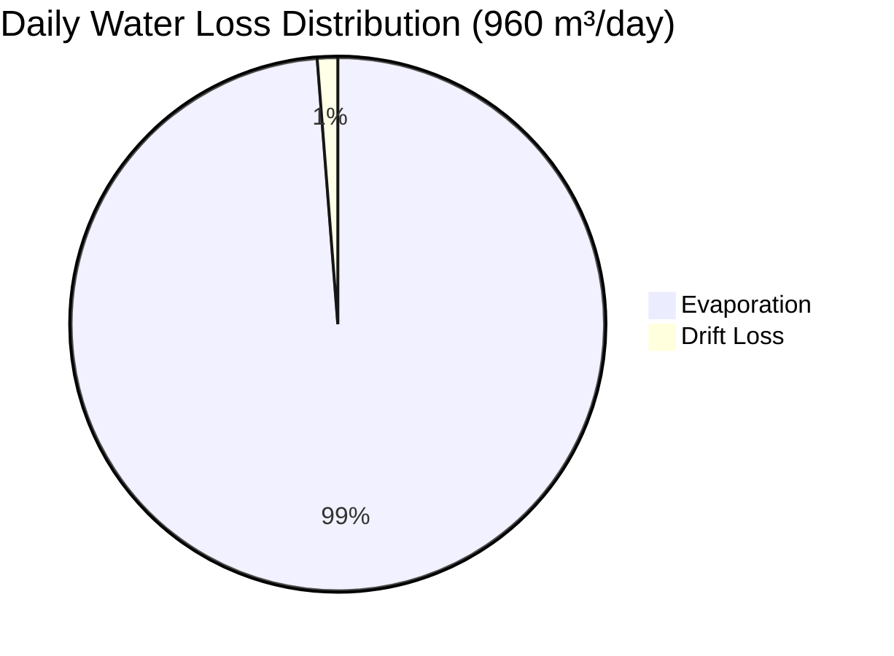
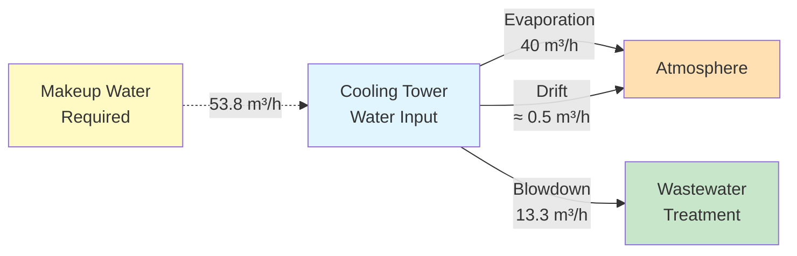
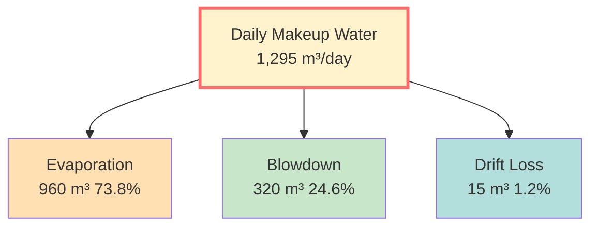
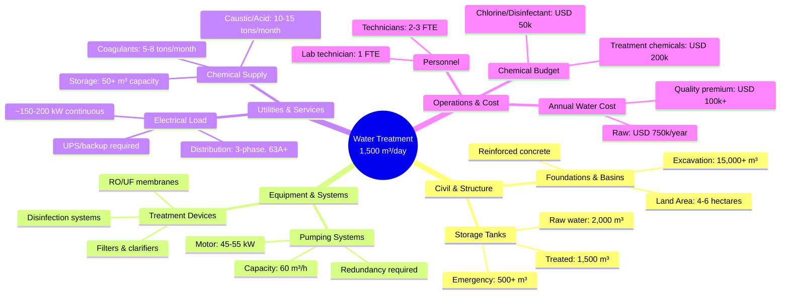
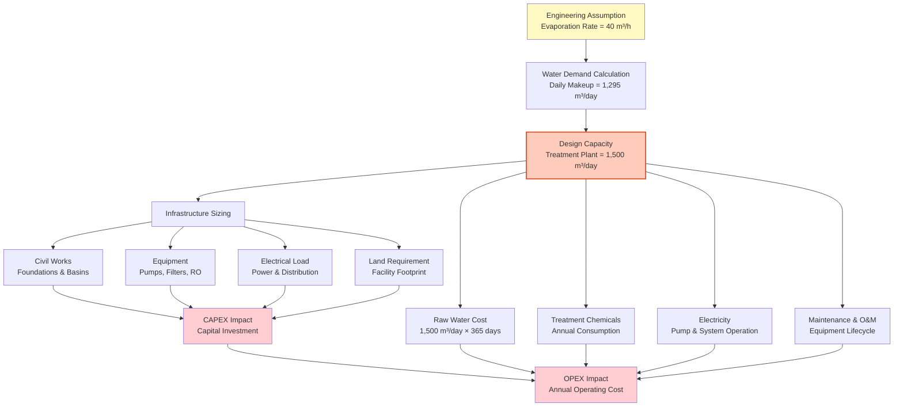
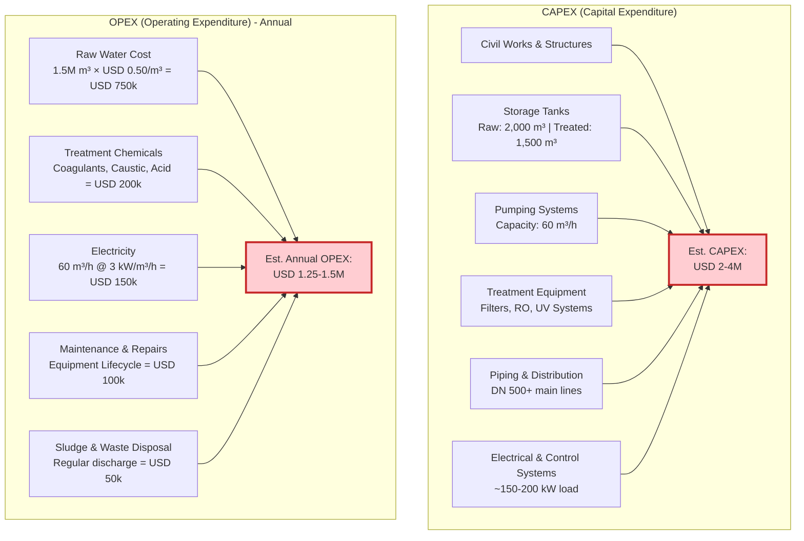

# Technical Note No.001
## Preliminary Water Demand Estimation for a 20MW Data Center

## Objective

This technical note demonstrates a preliminary engineering approach for estimating water demand and utility infrastructure requirements during the early planning stage of a 20MW AI Data Center.

From a Quantity Surveying (QS) and Project Controls perspective, the objective is to understand how engineering assumptions influence project cost, utility sizing, and long-term operational expenditure (OPEX).

## Design Assumptions

- **IT Load**: 20 MW
- **Cooling System**: Evaporative Cooling Tower
- **Cooling Tower Evaporation Loss (Assumption)**: 40 m³/h
- **Cycles of Concentration (COC)**: 4
- **Operating Hours**: 24 hours/day

*The evaporation rate used in this example is an engineering assumption for discussion purposes. Actual values should be confirmed during detailed design.*

## Engineering Assumptions

- Preliminary study only
- Water demand varies depending on climate, cooling technology and operating conditions
- All calculations are intended for conceptual planning and cost estimation

---

## Step 1. Evaporation Loss

Evaporation is the primary water loss mechanism in cooling towers. The rate depends on ambient conditions, wet-bulb temperature, and tower design.

### Daily Water Loss Calculation

$$E_{daily} = E_{hourly} \times t = 40 \text{ m³/h} \times 24 \text{ h/day} = 960 \text{ m³/day}$$

**Result**: Approximately **960 m³** of water is lost every day through evaporation alone.

### Water Loss Breakdown (24-hour cycle)



## Step 2. Blowdown Requirement

To control dissolved solids inside the cooling tower, blowdown is required. The blowdown rate ensures mineral concentration remains within acceptable limits.

### Blowdown Calculation Formula

$$B = \frac{E}{COC - 1}$$

Where:
- **B** = Blowdown rate (m³/h)
- **E** = Evaporation rate (m³/h)  
- **COC** = Cycles of Concentration (dimensionless)

### Applied Calculation

$$B = \frac{40}{4-1} = \frac{40}{3} = 13.3 \text{ m³/h}$$

**Daily Blowdown** = 13.3 × 24 = **320 m³/day**

---

### Water Loss Balance Diagram



## Step 3. Drift Loss (Entrainment Loss)

Modern cooling towers are equipped with high-efficiency **drift eliminators** to minimize water loss from water droplets carried away by exiting air streams.

### Drift Loss Calculation

For a well-designed cooling tower with modern drift eliminators:

$$D = E \times \text{Drift Factor (\%)}$$

**Modern cooling towers:**
- Without drift eliminators: 0.1-1.0% of circulating water
- With drift eliminators: 0.001-0.01% of circulating water
- With high-efficiency eliminators: 0.0005% of circulating water

**For this 40 m³/h system:**
$$D = 40 \text{ m³/h} \times 0.01\% = 0.004 \text{ m³/h} ≈ 0.1 \text{ m³/day}$$

**Practical assumption for design**: Drift loss is negligible compared to evaporation and blowdown (~0.1-1% of total water loss).

**Estimated drift in this study**: ~15 m³/day (conservative safety factor)

---

### Cooling Tower Water Loss Comparison

| Loss Type | Rate | Daily Volume | % of Total |
|-----------|------|--------------|-----------|
| Evaporation (primary) | 40 m³/h | 960 m³/day | 73.8% |
| Blowdown (concentration) | 13.3 m³/h | 320 m³/day | 24.6% |
| **Drift (entrainment)** | **0.6 m³/h** | **15 m³/day** | **1.2%** |
| **TOTAL MAKEUP REQUIRED** | **53.9 m³/h** | **1,295 m³/day** | **100%** |

The dominance of evaporation (>70%) underscores why **cooling tower efficiency** and **climate conditions** are critical design parameters.

## Step 4. Makeup Water Requirement

### Daily Water Balance

$$M = E_{daily} + B_{daily} + D_{daily}$$

Where:
- **M** = Makeup water required (m³/day)
- **E** = Daily evaporation (960 m³/day)
- **B** = Daily blowdown (320 m³/day)
- **D** = Daily drift loss (≈15 m³/day)

$$M = 960 + 320 + 15 = 1,295 \text{ m³/day} \approx 1,300 \text{ m³/day}$$

### Component Breakdown

| Component | Daily Volume | Percentage |
|-----------|----------|------------|
| Evaporation Loss | 960 m³ | 73.8% |
| Blowdown | 320 m³ | 24.6% |
| Drift Loss | 15 m³ | 1.2% |
| **Total Daily Makeup** | **1,295 m³** | **100%** |

### Visual Water Balance



### Design Allowance for System Losses

Beyond the core cooling tower losses, water treatment systems experience additional process losses:

$$T_{required} = M \times (1 + \text{Allowance})$$

$$T_{required} = 1,295 \times 1.15 = 1,489.25 \text{ m³/day}$$

Rounded to practical design capacity: **≈ 1,500 m³/day**

**Allowance Components (≈15%):**
- Filter backwash: 4-5%
- Maintenance & commissioning: 2-3%
- Process loss & leakage: 3-4%
- Operational margin: 3-4%

## Step 5. Water Treatment Design Capacity Confirmation

### Required Water Treatment Capacity (FEED Stage)

$$T_{design} = M_{daily} + \text{System Allowance} = 1,295 + 205 = 1,500 \text{ m³/day}$$

**Recommended Design Capacity: 1,500 m³/day**

*This capacity must be confirmed and validated during the Front End Engineering Design (FEED) phase with:*
- Detailed hydrological surveys
- Site-specific climate data analysis
- Cooling tower performance modeling
- Water availability assessment
- Regulatory discharge/reuse requirements
- Financial sensitivity analysis on water cost escalation

---

---

## Utility Planning Considerations

A water treatment plant of approximately **1,500 m³/day capacity is not a small utility package**. At this planning stage, utility engineering is no longer limited to process engineering — it becomes a **commercial and strategic decision**.

### Infrastructure Impact Analysis

The estimated treatment capacity directly affects **every project dimension**:



### Typical Water Treatment Plant Flowsheet

**A complete system includes these sequential stages:**

1. **Raw Water Intake & Storage**
   - Raw water storage tank (2,000+ m³)
   - Intake screening & preliminary treatment

2. **Primary Treatment**
   - Aeration tank (oxidation, degassing)
   - Clarifier or DAF (dissolved air flotation)
   - Sludge handling & disposal

3. **Secondary Treatment**
   - Multi-stage sand filtration
   - Activated carbon adsorption

4. **Tertiary/Advanced Treatment** (if required)
   - Ultrafiltration (UF) membrane
   - Reverse Osmosis (RO) — optional for high-purity water
   - Ion exchange for hardness reduction

5. **Disinfection & Polishing**
   - Chlorination or UV disinfection
   - Final pH adjustment
   - Corrosion control

6. **Distribution**
   - Treated water storage tank (1,500 m³)
   - Booster pump station
   - Distribution piping to end-use

7. **Waste Stream Management**
   - Blowdown treatment & discharge
   - Filter backwash recovery or discharge
   - Sludge dewatering & disposal

### Design & Operational Constraints

| Aspect | Consideration | Impact |
|--------|---------------|--------|
| **Raw Water Quality** | TDS, hardness, organics, pathogens | Treatment complexity & cost |
| **Climate** | Temperature, humidity, seasonal variation | Evaporation rate ± 20-30% |
| **Regulatory** | Discharge standards, reuse permits, environmental | Project delay & cost |
| **Land Availability** | Space for tanks, treatment units, storage | Site feasibility & civil cost |
| **Power Supply** | Grid capacity, tariff rates, backup requirements | Electrical CAPEX & OPEX |
| **Labor** | Technician availability, training, licensing | Operational cost escalation |

These engineering decisions become **commercial decisions** during project planning and must be integrated into cost estimation and risk management.

---

---

## Commercial Perspective for Project Controls & Quantity Surveying

For Quantity Surveyors and Project Controls professionals, utility planning is **not merely an engineering exercise** — it directly translates to commercial impact.

### Engineering-to-Commercial Impact Chain



### Critical Commercial Questions for QS Professionals

| Challenge | Commercial Impact | Value Engineering Option |
|-----------|------------------|--------------------------|
| **Large water plant capacity** | High CAPEX for civil works & equipment | Can reclaimed/recycled water reduce plant size? |
| **High daily water demand** | Escalating raw water costs | Can higher COC (≤6) reduce blowdown? |
| **Process losses (15%)** | Inefficient cost structure | Advanced treatment (RO/UF) recovery? |
| **Water availability risk** | Project delay/cost overrun risk | On-site reservoir or dual-source strategy? |
| **Chemical consumption** | Ongoing OPEX burden | Water quality optimization? |

### Typical Water Treatment Plant Facilities

The 1,500 m³/day capacity facility requires these typical systems:

```mermaid
graph LR
    Raw["Raw Water<br/>Storage Tank<br/>2,000 m³"] --> Aer["Aeration<br/>Tank"]
    Aer --> Clar["Clarifier<br/>Primary"]
    Clar --> Sand["Sand<br/>Filter"]
    Sand --> Carbon["Activated<br/>Carbon"]
    Carbon --> UF["Ultrafiltration<br/>UF Membrane"]
    UF --> RO["Reverse<br/>Osmosis<br/>Optional"]
    RO --> Disinfect["Disinfection<br/>Chlorine/UV"]
    Disinfect --> Treat["Treated Water<br/>Tank<br/>1,500 m³"]
    Treat --> CT["Cooling Tower<br/>System"]
    CT -->|"Blowdown"| Waste["Wastewater<br/>Treatment"]
    
    style Raw fill:#81d4fa
    style Treat fill:#a5d6a7
    style CT fill:#ffb74d
    style Waste fill:#ef9a9a
```



### Project Controls Impact Matrix



### Key Commercial Insights

1. **Water demand is NOT just operational** — it shapes every component of project cost:
   - **Civil structures** scale with tank and basin volumes
   - **Equipment sizing** (pumps, filters) grows with throughput
   - **Electrical load** increases with system power requirements
   - **Land footprint** expands with larger treatment plants

2. **Lifecycle cost perspective matters**:
   - CAPEX: USD 2-4M (upfront investment)
   - OPEX: USD 1.25-1.5M/year (ongoing burden)
   - **10-year project life**: Total cost ~USD 15-19M

3. **Value engineering opportunities**:
   - **Reduce blowdown**: Increase COC from 4 → 5-6 → saves ~100 m³/day blowdown
   - **Water reuse**: Recover 20% from treatment backwash → reduces raw water demand
   - **Advanced treatment**: RO permeate reuse → reduces virgin water sourcing
   - **Demand forecasting**: Confirm actual IT load to validate 40 m³/h assumption

4. **Project risk considerations**:
   - Water availability constraints → may require premium sourcing
   - Environmental permits → discharge limits on blowdown water
   - Utility infrastructure capacity → tie-in delays if shared systems
   - Long-term water pricing → commodity risk on annual OPEX

---

---

## Conclusion

### Engineering Assumptions → Commercial Reality

This technical note demonstrates a critical principle in project controls:

**A single engineering assumption (40 m³/h evaporation) cascades into:**

```
Engineering Input → Design Capacity → Infrastructure Requirements → Financial Impact → Project Risk
   40 m³/h       →  1,500 m³/day   →  2,000+ m³ storage      → USD 15-19M    → Water availability
                                        150+ kW electrical load    10-year lifecycle   Supply chain
                                        4-6 hectare footprint      Annual OPEX=USD 1.5M Environmental
```

### Why This Matters for Quantity Surveyors

Understanding water demand engineering improves:

1. **Cost Estimation Accuracy**: Utility sizing directly drives 10-15% of total project CAPEX
2. **Value Engineering**: Identification of optimization opportunities (COC, reuse, advanced treatment)
3. **Project Feasibility**: Early detection of resource constraints (water availability, electrical capacity)
4. **Risk Mitigation**: Commodity price forecasting, supply security, regulatory alignment
5. **Lifecycle Planning**: OPEX modeling for long-term asset management & profitability

### For the Project Team

**QS & Controls should validate:**
- ✓ Cooling tower evaporation rate assumption with equipment suppliers (ASHRAE TC 9.9 methodology)
- ✓ Local water cost & availability with utility authorities or water companies
- ✓ Environmental discharge standards for blowdown water
- ✓ Energy costs for treatment system operation
- ✓ Chemical pricing trends for annual budgeting
- ✓ Contingency allowance for water sourcing alternatives

**Preliminary Estimate Range** (USD, 20MW Data Center):
- **Best Case** (high COC, water reuse): CAPEX ~USD 2.5M, Annual OPEX ~USD 1.2M
- **Base Case** (standard design): CAPEX ~USD 3.5M, Annual OPEX ~USD 1.4M  
- **Worst Case** (low water availability, premium sourcing): CAPEX ~USD 4.5M, Annual OPEX ~USD 1.8M

---

---

## References & Standards

### Cooling Tower & Water Balance Standards

- **ASHRAE TC 9.9**: Cooling towers and water management systems
- **CTI Cooling Technology Institute**: Performance test codes and best practices
- **ASME PTC 23**: Direct Contact Cooling Towers (performance testing)
- **ISO 14046**: Water footprint principles, requirements, and guidelines

### Water Treatment & Reuse Standards

- **USEPA**: Water reuse guidelines and recycled water regulations
- **ASME A112.19.2**: Plumbing fixtures — water quality & reuse standards
- **NSF/ANSI 61**: Drinking water system components certification
- **ISO 20763**: Reclaimed water quality for cooling tower makeup

### Project Controls & Cost Estimation

- **AACE International Cost Estimate Classification System**
- **PMI PMBOK**: Cost Management Knowledge Area
- **RIBA Plan of Work**: Design stage gating and cost validation milestones

### Data Center & Utility Planning

- **The Uptime Institute**: Data center design & operations standards
- **PUE (Power Usage Effectiveness)**: Energy performance metrics
- **Water Reuse Index**: Facility water management benchmarking
- **Life Cycle Cost Analysis (LCCA)**: ISO 15686 standards

---

## Disclaimer & Limitations

This document presents a **conceptual engineering calculation** based on simplified assumptions for discussion and educational purposes.

**Important Notes:**
- Do not use as a substitute for detailed engineering design
- Evaporation rate (40 m³/h) is an assumption — must be validated by equipment supplier
- Water treatment plant design requires site-specific analysis (climate, soil conditions, regulatory requirements)
- CAPEX/OPEX estimates are indicative ranges only — obtain detailed quotations from vendors
- Local water supply, discharge standards, and environmental regulations vary by jurisdiction
- This document does not constitute engineering advice or professional recommendations

**Recommended Next Steps:**
1. Commission detailed hydrological and climate analysis
2. Obtain cooling tower performance guarantees from OEM
3. Engage with local water utility for supply/discharge requirements
4. Develop detailed utility specification during FEED phase
5. Include QS/Controls review in all utility-related design decisions

---

## Keywords & Searchable Terms

**Primary Topics:**  
`Data Center Design` · `Cooling Tower` · `Evaporative Cooling` · `Water Treatment` · `Utility Planning` · `Water Balance` · `Makeup Water Requirement`

**Engineering Disciplines:**  
`MEP Engineering` · `Mechanical Systems` · `Infrastructure Design` · `Environmental Engineering` · `Process Engineering`

**Project Management:**  
`Project Controls` · `Quantity Surveying` · `Cost Estimation` · `Value Engineering` · `FEED Phase` · `Design Gating`

**Financial & Commercial:**  
`CAPEX` · `OPEX` · `Lifecycle Cost` · `Cost Planning` · `Project Budget` · `Economic Feasibility` · `Financial Modeling`

**Sustainability & Operations:**  
`Water Reuse` · `Wastewater Recycling` · `Sustainability` · `Operational Efficiency` · `Carbon Footprint` · `Water Footprint` · `ESG Compliance`

**Technical Standards:**  
`ASHRAE` · `CTI` · `ISO 14046` · `ASME` · `FEED` · `Design Standards` · `Performance Testing`

---

## Document Metadata

- **Classification**: Technical Note | Preliminary Engineering Study
- **Version**: 2.0 (Enhanced with calculations, diagrams, commercial analysis)
- **Intended Audience**: Quantity Surveyors, Project Controls, Capital Planning Teams, Facility Managers
- **Application**: 20MW AI Data Center (Preliminary Planning & Cost Estimation)
- **Review Date**: Next revision recommended during FEED phase
- **Format**: Markdown with LaTeX mathematics and Mermaid diagrams

#DataCenter #QuantitySurveying #ProjectControls #WaterTreatment #CoolingTower #CAPEX #OPEX #UtilityPlanning #Sustainability