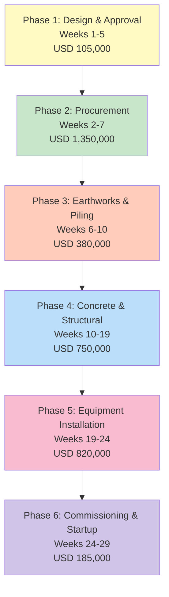
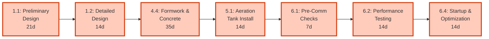
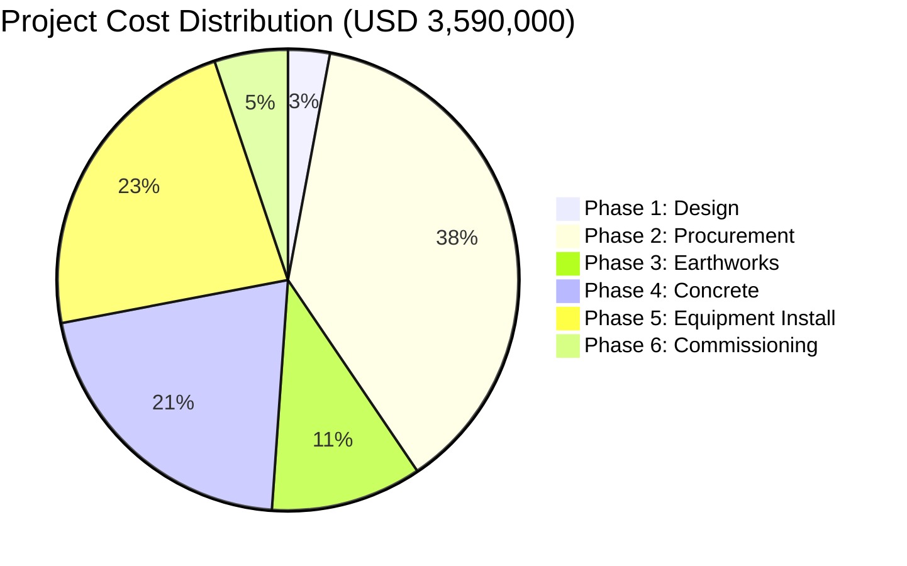
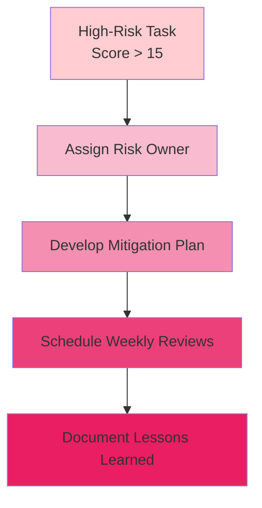

# Water Treatment Plant (WTP) - Project Schedule
## 20MW Data Center | Water Treatment Infrastructure

**Project Duration:** 29 weeks (~7 months)  
**Total Project Cost:** USD 3,590,000  
**Client:** Data Center Operations  
**Location:** On-site, Data Center Facility

---

## Executive Summary

This document presents the comprehensive project schedule for the Water Treatment Plant supporting a 20MW AI Data Center. The schedule integrates design, procurement, civil works, equipment installation, and commissioning phases with detailed cost and risk assessment.

**Key Dates:**
- **Project Start:** Week 1 (Preliminary Design)
- **Construction Start:** Week 6 (Site Preparation)
- **Equipment Installation:** Week 19
- **Plant Commissioning:** Week 24
- **Operational Handover:** Week 29

---

## Project Phases Overview



---

## Detailed Project Schedule

### Phase 1: Design & Approval (Weeks 1-5)

| Task ID | Task Name | Duration | Week Start | Week End | Lead | Cost | Risk |
|---------|-----------|----------|------------|----------|------|------|------|
| 1.1 | Preliminary Design | 21 days | 1 | 3 | Design Engineer | USD 50,000 | Low |
| 1.2 | Detailed Design | 14 days | 3 | 5 | Design Engineer | USD 40,000 | Low |
| 1.3 | Regulatory Permits & Approvals | 28 days | 1 | 5 | Project Manager | USD 15,000 | Medium |

**Milestones:**
- ✓ Week 3: Preliminary design approval
- ✓ Week 5: Detailed design & permits complete

---

### Phase 2: Procurement (Weeks 2-7) - Parallel with Design

| Task ID | Task Name | Duration | Week Start | Week End | Lead | Cost | Risk |
|---------|-----------|----------|------------|----------|------|------|------|
| 2.1 | Material Procurement - Tanks & Equipment | 35 days | 2 | 7 | Procurement Mgr | USD 850,000 | **High** |
| 2.2 | Concrete & Reinforcement | 21 days | 4 | 7 | Procurement Mgr | USD 200,000 | Medium |
| 2.3 | Piping & Fittings | 21 days | 4 | 7 | Procurement Mgr | USD 120,000 | Medium |
| 2.4 | Electrical & Control Systems | 28 days | 3 | 7 | Procurement Mgr | USD 180,000 | Medium |

**Equipment Breakdown:**
- **Aeration Tank:** 500 m³ reinforced concrete
- **Clarifier:** 400 m³ with settling mechanism
- **Triple Sand Filter:** 3× 200 m³ units
- **Chlorination System:** 50 ppm capacity
- **EDI Filter:** High-purity water polishing

**Milestones:**
- Week 2: Purchase orders issued
- Week 7: All major equipment on-site

---

### Phase 3: Earthworks & Piling (Weeks 6-10)

| Task ID | Task Name | Location | Duration | Week Start | Week End | Lead | Cost | Risk |
|---------|-----------|----------|----------|------------|----------|------|------|------|
| 3.1 | Site Preparation & Survey | Site | 7 days | 6 | 7 | Site Manager | USD 30,000 | Low |
| 3.2 | Piling Design Submission | Office | 7 days | 6 | 7 | Structural Eng | USD 20,000 | Medium |
| 3.3 | Piling Works | Foundation | 21 days | 7 | 10 | Piling Contractor | USD 250,000 | **High** |
| 3.4 | Excavation & Dewatering | Site | 14 days | 8 | 10 | Excavation Contractor | USD 80,000 | **High** |

**Geotechnical Parameters:**
- Depth of excavation: 5-6 meters
- Piling depth: 15+ meters (based on soil survey)
- Dewatering requirement: ~50-100 m³/day during excavation
- Groundwater control: 24/7 dewatering system

**Milestones:**
- Week 7: Piles driven
- Week 10: Excavation complete, groundwater controlled

---

### Phase 4: Concrete & Structural Works (Weeks 10-19)

| Task ID | Task Name | Location | Duration | Week Start | Week End | Lead | Cost | Risk |
|---------|-----------|----------|----------|------------|----------|------|------|------|
| 4.1 | Pile Cutting | Foundation | 7 days | 10 | 11 | Cutting Specialist | USD 40,000 | **High** |
| 4.2 | Pile Capping & Foundation | Foundation | 14 days | 11 | 13 | Concrete Contractor | USD 120,000 | **High** |
| 4.3 | Anchoring & Reinforcement | Foundation | 14 days | 11 | 13 | Steel Contractor | USD 100,000 | **High** |
| 4.4 | Formwork & Concrete Pour | All Tanks | 35 days | 12 | 17 | Concrete Contractor | USD 350,000 | **High** |
| 4.5 | Waterproofing - Floor & Walls | All Tanks | 21 days | 17 | 19 | Waterproofing Specialist | USD 150,000 | Medium |
| 4.6 | Curing & Quality Testing | Site | 14 days | 17 | 19 | QC Engineer | USD 40,000 | Medium |

**Concrete Specification:**
- **Grade:** C35 reinforced concrete
- **Waterproofing:** 2-layer bituminous + PVC membrane
- **Curing Time:** 28 days minimum
- **Quality Control:** Daily cube testing, weekly inspections

**Critical Path Items:**
- ⚠️ Pile cutting timing (safety critical)
- ⚠️ Concrete pour sequencing (weather dependent)
- ⚠️ Waterproofing completion before equipment installation

**Milestones:**
- Week 13: Foundation complete
- Week 17: All formwork removed, curing begins
- Week 19: Concrete quality approved, waterproofing complete

---

### Phase 5: Equipment Installation (Weeks 19-24)

| Task ID | Task Name | Location/Equipment | Duration | Week Start | Week End | Lead | Cost | Risk |
|---------|-----------|----------|----------|------------|----------|------|------|------|
| 5.1 | Aeration Tank Installation | Aeration | 14 days | 19 | 21 | Equipment Installer | USD 120,000 | **High** |
| 5.2 | Clarifier Installation | Clarifier | 14 days | 20 | 22 | Equipment Installer | USD 100,000 | **High** |
| 5.3 | Sand Filter Installation (Triple) | Filter | 21 days | 20 | 23 | Equipment Installer | USD 180,000 | **High** |
| 5.4 | Chlorination System Installation | Disinfection | 14 days | 22 | 24 | Equipment Installer | USD 80,000 | Medium |
| 5.5 | EDI Filter Installation | Polishing | 14 days | 22 | 24 | Equipment Installer | USD 90,000 | Medium |
| 5.6 | Piping & Connections | All Systems | 21 days | 20 | 23 | Piping Contractor | USD 140,000 | **High** |
| 5.7 | Electrical & Control Installation | All Systems | 21 days | 21 | 24 | Electrical Contractor | USD 110,000 | **High** |

**Installation Sequence:**
1. **Weeks 19-21:** Aeration tank → internal systems
2. **Weeks 20-22:** Clarifier → settling mechanisms
3. **Weeks 20-23:** Sand filters → cartridge installation
4. **Weeks 20-23:** Piping infrastructure → final connections
5. **Weeks 21-24:** Electrical distribution → PLC/SCADA setup
6. **Weeks 22-24:** Disinfection & polishing systems → chemical feeds

**Critical Dependencies:**
- Concrete cure complete (Week 19) → Equipment installation
- Piping must precede chemical systems
- Electrical last stage (safety)

**Milestones:**
- Week 21: All tanks installed
- Week 23: All piping complete
- Week 24: All equipment functional

---

### Phase 6: Commissioning & Startup (Weeks 24-29)

| Task ID | Task Name | Location | Duration | Week Start | Week End | Lead | Cost | Risk |
|---------|-----------|----------|----------|------------|----------|------|------|------|
| 6.1 | System Pre-Commissioning Checks | Site | 7 days | 24 | 25 | Commissioning Eng | USD 50,000 | **High** |
| 6.2 | Water Balance & Performance Testing | Site | 14 days | 25 | 27 | Commissioning Eng | USD 60,000 | **High** |
| 6.3 | Staff Training & Handover | Site/Office | 7 days | 26 | 27 | Project Manager | USD 35,000 | Low |
| 6.4 | Plant Startup & Optimization | Site | 14 days | 27 | 29 | Operations Manager | USD 40,000 | **High** |

**Pre-Commissioning Checklist:**
- ✓ All equipment functional tests
- ✓ Piping pressure tests (1.5× design pressure)
- ✓ Electrical load testing
- ✓ Control system validation
- ✓ Chemical feed systems primed

**Performance Testing:**
- Water balance: Evaporation + blowdown vs. makeup (target: 1,500 m³/day)
- Filtration efficiency: 99.9% suspended solids removal
- Chlorination residual: 0.5-2.0 ppm
- EDI outlet purity: <100 µS/cm conductivity

**Operational Handover:**
- Week 27: Staff certification
- Week 29: Full operational control

**Milestones:**
- Week 25: All systems tested & approved
- Week 27: Operations team certified
- Week 29: Plant operational & optimized

---

## Critical Path Analysis

### Longest Duration Path (29 weeks)



**Total Duration:** 35+14+21+14+7+14+14 = **119 days = 17 weeks minimum**
**Actual Schedule:** 29 weeks (allowing 3-week contingency + parallel activities)

### Activities with Float (Schedule Flexibility)

- **Regulatory Permits (1.3):** Can be extended if delayed (parallel with design)
- **Equipment Delivery (2.1):** 2-3 weeks buffer available
- **Training (6.3):** Can overlap with final commissioning

---

## Cost Management

### Phase-wise Cost Breakdown



### Cost by Category

| Category | Amount (USD) | % of Total | Notes |
|----------|-------------|----------|-------|
| **Equipment & Materials** | 1,800,000 | 50.1% | Tanks, filters, systems |
| **Labor & Construction** | 1,150,000 | 32.0% | Piling, concrete, installation |
| **Design & Engineering** | 120,000 | 3.3% | Design, permits, inspection |
| **Commissioning & Training** | 185,000 | 5.2% | Testing, startup, training |
| **Contingency (5%)** | 179,500 | 5.0% | Risk allowance |
| **Administration** | 155,500 | 4.3% | PM, quality control |
| **TOTAL** | **3,590,000** | **100%** | |

---

## Risk Management

### High-Risk Activities (Mitigation Required)

| Task | Risk | Impact | Mitigation |
|------|------|--------|-----------|
| **2.1: Equipment Procurement** | Delivery delays | 2-4 week delay | Pre-order long-lead items; dual suppliers |
| **3.3: Piling Works** | Soil variation/ground difficulty | Cost overrun 10-20% | Detailed geotechnical survey; contingency |
| **3.4: Dewatering** | Excessive groundwater | Flooding risk; delays | 24/7 pump standby; check dams |
| **4.1: Pile Cutting** | Safety hazard; equipment failure | Injury/cost | Safety protocol; certified operator |
| **4.4: Concrete Pour** | Weather (rain); poor curing | Quality defects | Weather monitoring; wet-weather plan |
| **5.1-5.7: Equipment Install** | Damage during transport; misalignment | Rework cost 10-15% | Padded transport; pre-commissioning checks |
| **6.1-6.2: Commissioning** | System integration issues | Extended startup 1-2 weeks | Phased testing; vendor support on-site |

### Risk Scoring & Response



---

## Resource Plan

### Key Personnel

| Role | Requirement | Weeks Active | Notes |
|------|-----------|--------------|-------|
| Project Manager | 1 FTE | 1-29 | Full-time oversight |
| Design Engineer | 2 FTE | 1-5 | Concurrent preliminary & detailed |
| Site Manager | 1 FTE | 6-24 | Construction supervision |
| Structural Engineer | 1 FTE | 6-13 | Piling & foundation design |
| Commissioning Engineer | 1 FTE | 24-29 | System startup & optimization |
| Quality Control | 1 FTE | 10-24 | Concrete & equipment verification |

### Equipment Resources

- Excavator: Weeks 8-10 (earthworks)
- Concrete pump: Weeks 12-17 (pours)
- Crane: Weeks 19-24 (equipment lifting)
- Test equipment: Weeks 24-29 (commissioning)

---

## Schedule Metrics & KPIs

### Baseline Schedule Performance

| Metric | Target | Tracking Method |
|--------|--------|-----------------|
| **Schedule Performance Index (SPI)** | > 0.95 | Weekly progress review |
| **Cost Performance Index (CPI)** | > 0.90 | Monthly cost reconciliation |
| **Critical Path Float** | > 5 days | Schedule update every 2 weeks |
| **Variance at Completion (VAC)** | < 5% | Monthly forecast |

### Progress Monitoring

- **Weekly:** Task progress % completion
- **Bi-weekly:** Critical path review
- **Monthly:** Cost vs. budget reconciliation
- **Quarterly:** Overall schedule forecast update

---

## Quality & Compliance

### Testing & Certification

**Structural:**
- Concrete cube strength tests (28-day cure)
- Pile integrity testing (ultrasonic)
- Waterproofing membrane integrity test

**Mechanical:**
- Pump performance curves
- Filter flow rate & pressure drop
- Tank hydrostatic pressure test

**Water Quality:**
- Initial system flushing (72 hours)
- Chlorine residual: 0.5-2.0 ppm
- Turbidity: < 1 NTU
- Conductivity: < 100 µS/cm (post-EDI)

### Compliance Standards

- **ASHRAE TC 9.9:** Cooling tower design & operation
- **ISO 9001:** Quality management system
- **OSHA:** Occupational safety (construction phase)
- **EPA:** Water discharge regulations
- **Local Authority:** Building permits & inspections

---

## Contingency & Change Management

### Contingency Budget Allocation

- **Design Phase:** 10% (regulatory uncertainty)
- **Procurement:** 5% (price volatility)
- **Construction:** 10% (ground conditions, weather)
- **Commissioning:** 5% (system integration)
- **Overall:** 5% of total project cost

### Change Control Process

```
Change Request
    ↓
Impact Assessment (Schedule, Cost, Quality)
    ↓
Approval/Rejection
    ↓
Implementation (if approved)
    ↓
Baseline Update
```

---

## Deliverables & Documentation

### Handover Documents

1. **As-Built Drawings** (signed by engineers)
2. **Operation & Maintenance Manual**
3. **Spare Parts List & Inventory**
4. **Staff Training Certification**
5. **Warranty & Service Agreements**
6. **Performance Test Reports**
7. **Commissioning Sign-Off (Owner/Operator)**

---

## Success Criteria

✅ **On-Time Completion:** Within 29 weeks  
✅ **Budget Compliance:** Within 5% of USD 3.59M  
✅ **Quality Standards:** All tests passed, certifications obtained  
✅ **Safety Record:** Zero lost-time incidents  
✅ **Performance Achievement:** 1,500 m³/day capacity, >99.9% treatment efficiency  
✅ **Stakeholder Satisfaction:** Final approval & operational handover  

---

## Conclusion

This comprehensive schedule integrates all major phases of the Water Treatment Plant project, from design through commissioning. The 29-week timeline provides a realistic pathway with embedded contingencies for equipment procurement, construction challenges, and system integration.

**For MRICS APC Application:** This schedule demonstrates:
- **Project Controls Competency:** Integration of cost, schedule, and resource management
- **Risk Management:** Identification and mitigation of high-impact activities
- **Value Engineering:** Phased approach optimizing delivery time and cost
- **Earned Value Analysis:** Baseline for progress tracking and performance measurement

---

**Document Control:**
- **Version:** 1.0
- **Date:** June 2026
- **Status:** Baseline Schedule
- **Next Review:** Upon design phase completion (Week 5)
