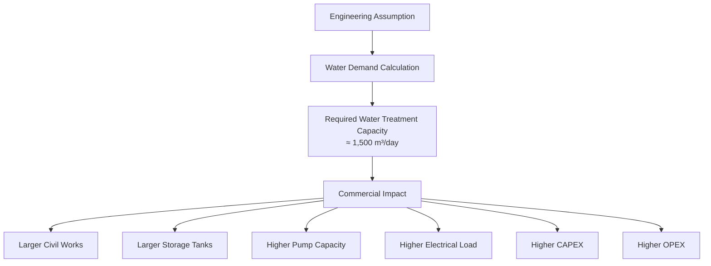

# Technical Note No.001
## Preliminary Water Demand Estimation for a 20MW Data Center

## Objective

This technical note demonstrates a preliminary engineering approach for estimating water demand and utility infrastructure requirements during the early planning stage of a 20MW AI Data Center.

From a Quantity Surveying (QS) and Project Controls perspective, the objective is to understand how engineering assumptions influence project cost, utility sizing, and long-term operational expenditure (OPEX).

## Design Assumptions

- **IT Load**: 20 MW
- **Cooling System**: Evaporative Cooling Tower
- **Cooling Tower Evaporation Loss (Assumption)**: 40 m³/h
- **Cycles of Concentration (COC)**: 4
- **Operating Hours**: 24 hours/day

*The evaporation rate used in this example is an engineering assumption for discussion purposes. Actual values should be confirmed during detailed design.*

## Engineering Assumptions

- Preliminary study only
- Water demand varies depending on climate, cooling technology and operating conditions
- All calculations are intended for conceptual planning and cost estimation

---

## Step 1. Evaporation Loss

**Evaporation Loss** = 40 m³/h

**Daily Evaporation** = 40 × 24 = **960 m³/day**

Approximately 960 m³ of water is lost every day through evaporation.

## Step 2. Blowdown Requirement

To control dissolved solids inside the cooling tower, blowdown is required.

**Blowdown** = Evaporation ÷ (COC − 1)
= 40 ÷ (4 − 1)
= **13.3 m³/h**

**Daily Blowdown** = 13.3 × 24 ≈ **320 m³/day**

## Step 3. Drift Loss

Modern cooling towers are equipped with drift eliminators.

For this preliminary estimation, drift loss is considered negligible compared with evaporation and blowdown.

## Step 4. Makeup Water Requirement

| Component | Quantity |
|-----------|----------|
| Daily Evaporation | 960 m³/day |
| Daily Blowdown | 320 m³/day |
| Estimated Drift | 10–20 m³/day |
| **Estimated Makeup Water** | **≈ 1,300 m³/day** |

### Engineering Allowance

- Filter Backwash
- Maintenance
- Process Loss
- Operational Margin
- **Total Allowance**: ≈15%

### Recommended Water Treatment Capacity

**≈1,500 m³/day**

## Step 5. Water Treatment Capacity

Water treatment facilities must also account for process losses including filter backwash, sludge removal, operational margin, and maintenance.

Assuming an additional design allowance of approximately 15–20%:

**Required Water Treatment Capacity** ≈ **1,500 m³/day**

*This capacity should be confirmed during the FEED (Front End Engineering Design) stage.*

---

## Utility Planning Considerations

A water treatment plant of approximately 1,500 m³/day is not a small utility package. At this stage, utility planning is no longer limited to process engineering.

The estimated treatment capacity directly affects:
- Civil structures
- Equipment sizing
- Electrical demand
- Chemical consumption
- Land requirement
- Long-term operating costs

These engineering decisions become commercial decisions during project planning.

### Typical Facilities Include

- Raw Water Storage Tank
- Aeration Tank
- Clarifier
- Sand Filter
- Activated Carbon Filter
- Ultrafiltration (UF)
- Reverse Osmosis (RO), if required
- Disinfection System
- Treated Water Tank

The required land area, civil works, electrical load, chemical consumption, and operation costs should all be considered during project planning.

---

## Commercial Perspective

For Quantity Surveyors and Project Controls professionals, utility planning is not only an engineering exercise.

### Engineering Result → Commercial Impact

```
Engineering Result
↓
Required Water Treatment Capacity ≈ 1,500 m³/day
↓
Commercial Impact:
  • Larger Water Treatment Plant
  • Larger Civil Foundation
  • Larger Storage Tanks
  • Higher Pump Capacity
  • Additional Electrical Load
  • Higher Chemical Consumption
  • Increased Annual Water Cost
  • Higher O&M Cost
  • Increased CAPEX
↓
QS Questions:
  • Can reclaimed water reduce plant capacity?
  • Can higher Cycles of Concentration reduce blowdown?
  • Can additional treatment reduce long-term OPEX?
```



### Key Commercial Insights

The estimated water demand of approximately **1,500 m³/day** is not simply an operational figure. It has a direct impact on:

1. **Project Cost**: Larger treatment capacity requires larger tanks, bigger pumps, additional piping, electrical systems, civil structures, and chemical dosing equipment
2. **CAPEX**: Direct increase in capital expenditure
3. **OPEX**: Annual costs including:
   - Raw water
   - Treatment chemicals
   - Electricity
   - Maintenance
   - Sludge disposal
   - Equipment replacement
4. **Project Risk**: Water availability can become a significant constraint
   - May require additional water treatment plant
   - May require storage reservoir or reclaimed water facility
   - These decisions significantly influence budget and schedule

---

## Conclusion

This study illustrates how a simple engineering assumption can be translated into utility sizing and commercial planning.

For Quantity Surveyors, understanding utility systems improves:
- Cost estimation
- Value engineering
- Project feasibility analysis during early stages of project development

---

## References

### Recommended References

- ASHRAE TC 9.9
- CTI Cooling Technology Institute
- USEPA Water Reuse Guidelines
- ASME Performance Test Codes
- ISO 14046 Water Footprint

---

## Disclaimer

This document presents a conceptual engineering calculation based on simplified assumptions for discussion and educational purposes. It should not be used as a substitute for detailed engineering design.

---

## Keywords

`Data Center` `Cooling Tower` `Utility Planning` `Water Balance` `Wastewater Reuse` `Water Treatment` `Cooling Water` `Project Controls` `Quantity Surveying` `Value Engineering` `CAPEX` `OPEX` `Life Cycle Cost` `Infrastructure Planning` `Engineering Calculation` `FEED` `Sustainability`

#DataCenter #QuantitySurveying #ProjectControls #CoolingTower #WaterTreatment #CostPlanning #UtilityPlanning #CAPEX #OPEX #Sustainability